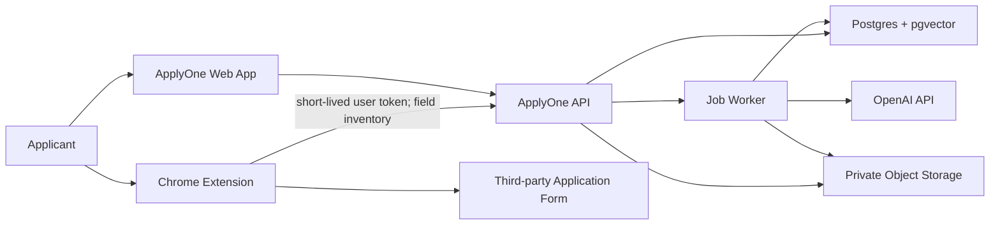

# ApplyOne Technical Requirements and Design

**Status:** Proposed greenfield architecture v1.0  
**Source state:** The linked GitHub repository was empty when inspected on 15 August 2026. This design therefore defines the initial implementation rather than describing existing code.

## 1. Technical Objectives

- Implement the PRD’s complete MVP journey without autonomous submission.
- Guarantee user-level isolation for structured data, embeddings, and files.
- Ground AI output in approved user evidence and preserve provenance.
- Make long-running extraction/generation observable, retryable, and idempotent.
- Keep the hackathon build deployable as one web application, one extension, and managed services.

## 2. Recommended Stack

| Layer | Choice | Rationale |
|---|---|---|
| Web | Next.js App Router + TypeScript | One deployable UI/API surface; typed server and client code |
| UI | Tailwind CSS + accessible headless components | Fast, consistent product UI without sacrificing keyboard support |
| Validation | Zod | Shared request, response, and AI-output schemas |
| Database/Auth/Storage | Supabase (Postgres, Auth, private Storage) | Fast managed foundation with Row Level Security |
| Vector search | pgvector in Postgres | Evidence retrieval stays inside the permissioned data store |
| AI | OpenAI Responses API with structured outputs and embeddings | Schema-constrained extraction/drafting; server-side only |
| Async work | Postgres jobs table + scheduled worker initially | Minimal infrastructure; replace with a dedicated queue when volume requires |
| Extension | Chrome Manifest V3, TypeScript, service worker/content script | Current extension security model and user-invoked page integration |
| Testing | Vitest, Testing Library, Playwright | Unit, component, integration, and end-to-end coverage |
| Hosting | Vercel + Supabase | Simple preview and production deployments |
| Observability | Structured server logs + error monitoring | Correlation IDs, job state, latency, and failures without sensitive payloads |

Version policy: pin exact versions in the lockfile during implementation and use currently supported stable releases. Architecture references: [Next.js App Router](https://nextjs.org/docs/app), [Supabase database and RLS](https://supabase.com/docs/guides/database/overview), [permission-aware RAG](https://supabase.com/docs/guides/ai/rag-with-permissions), [OpenAI API documentation](https://platform.openai.com/docs), and [Chrome Manifest V3](https://developer.chrome.com/docs/extensions/develop/migrate/what-is-mv3).

## 3. System Context



Trust boundaries:

- Third-party page content is untrusted input.
- The extension receives only data required for the active, user-approved fill session.
- The AI provider never receives unrelated profile fields or documents.
- Service-role database/storage credentials exist only in trusted server/worker environments.

## 4. Repository Structure

```text
/
├── apps/
│   ├── web/
│   │   ├── src/app/                 # routes, layouts, route handlers
│   │   ├── src/features/            # profile, documents, opportunities, applications
│   │   ├── src/components/          # shared accessible UI
│   │   └── src/lib/                 # auth, database, AI, jobs, logging
│   └── extension/
│       ├── src/background/          # MV3 service worker and auth/session broker
│       ├── src/content/             # field inventory and controlled fill adapter
│       ├── src/popup/               # preview and confirmation UI
│       └── manifest.json
├── packages/
│   ├── contracts/                   # Zod schemas and shared domain types
│   ├── config/                      # lint, TypeScript, test configuration
│   └── form-engine/                 # platform-neutral field matching rules
├── supabase/
│   ├── migrations/                  # schema, indexes, RLS, functions
│   └── seed.sql                     # non-sensitive demo fixtures
├── workers/
│   └── ai-jobs/                     # extraction, embeddings, analysis, drafting
├── tests/
│   ├── e2e/                         # web journeys
│   ├── extension/                   # static form fixtures and browser tests
│   └── security/                    # RLS and authorization tests
└── docs/                             # PRD, TRD, feature backlog
```

## 5. Domain Model

All user-owned tables include `user_id`, timestamps, and RLS policies. UUIDs are used for public identifiers. Soft deletion is used only where needed for recovery; account deletion follows the retention policy.

| Entity | Key fields and purpose |
|---|---|
| `profiles` | canonical personal/contact/preferences fields, onboarding state |
| `profile_facts` | typed fact, value JSON, source, confidence, verification status |
| `experiences` | education, employment, projects, leadership, volunteering |
| `evidence_items` | situation/action/outcome/metrics/skills, approved/excluded state |
| `documents` | logical document identity, type, label, current version |
| `document_versions` | immutable storage path, hash, MIME, extraction state, expiry |
| `document_chunks` | extracted text chunk, embedding, source page/section, user ID |
| `opportunities` | URL/manual source, category, normalized fields, analysis status |
| `requirements` | requirement text/type, hard/soft, source, confidence |
| `applications` | opportunity, status, deadline, next action, persona |
| `application_questions` | prompt, limit/unit, order, source |
| `answer_versions` | immutable draft/edit text, evidence IDs, model metadata, approval |
| `application_documents` | application-to-specific-document-version mapping |
| `eligibility_results` | requirement-to-fact evaluation and explanation |
| `submission_snapshots` | submitted-at time, answer/version manifest, document manifest |
| `contacts` | recruiter/coordinator information linked to application |
| `reminders` | scheduled time, channel, status, idempotency key |
| `jobs` | task type, input reference, state, attempts, error code, correlation ID |
| `audit_events` | security/product event name and redacted metadata |

Important constraints:

- `document_versions(file_hash, user_id)` supports duplicate detection.
- Only one approved answer version per question; approval change is transactional.
- Submission snapshots store immutable manifests, not mutable foreign-key-only views.
- Vector queries always filter by authenticated `user_id` before similarity ranking.
- Application category is an extensible enum/reference table, not a separate schema per category.

## 6. Core Data Flows

### 6.1 Document to approved evidence

1. Client requests an upload session and validates basic size/type.
2. Server creates `document_version` in `uploading` state and returns a signed upload target.
3. Completion endpoint verifies ownership, MIME/signature, hash, and malware-scan result.
4. Idempotent job extracts text and emits structured fact/evidence candidates.
5. Candidates are stored as `unverified`; embeddings are created only for permitted text.
6. User confirms/edits candidates, changing them to `verified` and eligible for drafting.

### 6.2 Opportunity URL to workspace

1. Server canonicalizes and validates the URL, blocks private/link-local addresses, and fetches with size/time/redirect limits.
2. HTML is converted to bounded plain text; scripts and instructions are discarded.
3. Structured extraction produces opportunity fields, requirements, documents, and questions with source spans/confidence.
4. User reviews corrections; an application workspace is created.
5. Eligibility engine compares explicit requirements with verified facts and returns `met`, `not_met`, `unclear`, or `not_evaluated`.

### 6.3 Evidence-grounded drafting

1. Request validates question, limit, persona, and application ownership.
2. Hybrid retrieval filters the user’s approved evidence, then ranks semantic and structured matches.
3. Model receives only the prompt, opportunity context, selected evidence, and schema/instructions.
4. Structured response contains draft text, evidence IDs, missing facts, and warnings.
5. Server verifies referenced IDs, checks length, and runs claim/evidence validation.
6. Result is stored as an immutable answer version; user edits and explicitly approves a version.

### 6.4 Extension fill

1. User invokes extension on the active tab; content script inventories supported fields and labels.
2. Inventory is sent to the API with origin and application ID; raw unrelated page content is not retained.
3. Form engine returns proposed mappings with source IDs and confidence.
4. Popup shows preview; user selects mappings and document versions.
5. Content script fills selected targets and dispatches expected input/change events.
6. Extension reports result per field. Submit, signature, attestation, CAPTCHA, and payment controls are excluded by rule.

## 7. API Contracts

All endpoints are authenticated unless noted. Responses use `{ data, error, requestId }`; errors have stable `code`, safe `message`, and optional field details. Mutating job-creation endpoints accept `Idempotency-Key`.

| Method and path | Purpose | Result |
|---|---|---|
| `GET /api/profile` | Read canonical profile | Profile plus completeness |
| `PATCH /api/profile` | Validate/update profile | Updated profile and audit ID |
| `POST /api/documents/uploads` | Start private upload | Version ID and signed upload target |
| `POST /api/documents/{id}/process` | Enqueue extraction | `202` job resource |
| `POST /api/opportunities/analyze` | Analyze URL or pasted text | `202` job resource |
| `PATCH /api/opportunities/{id}` | Confirm/correct analysis | Updated opportunity |
| `POST /api/applications` | Create workspace | Application resource |
| `POST /api/applications/{id}/eligibility` | Evaluate explicit requirements | Results with citations |
| `POST /api/questions/{id}/drafts` | Generate grounded draft | `202` job resource |
| `POST /api/answers/{id}/approve` | Approve immutable version | Approval record |
| `POST /api/applications/{id}/fill-plan` | Build extension preview | Expiring plan with mappings |
| `POST /api/applications/{id}/submit-snapshot` | Record user-confirmed submission | Immutable snapshot |
| `GET /api/jobs/{id}` | Poll async state | queued/running/succeeded/failed |
| `POST /api/account/export` | Create portable export | `202` job resource |
| `DELETE /api/account` | Confirm deletion workflow | Deletion receipt/state |

Example draft response schema:

```json
{
  "text": "string",
  "evidenceIds": ["uuid"],
  "missingFacts": ["string"],
  "warnings": ["string"],
  "characterCount": 0
}
```

## 8. AI Design and Safety

### Tasks

- Structured resume/document extraction.
- Opportunity and question extraction.
- Evidence retrieval/ranking.
- Requirement comparison.
- Answer drafting and optional rewriting.

### Controls

- Server-side prompts, schema-constrained JSON, bounded input/output, timeout, and retry policy.
- Prompt-injection defense: external documents/pages are delimited as data; their embedded instructions are ignored.
- Retrieved evidence is permission-filtered and includes stable IDs.
- Drafting prompt prohibits unsupported facts and instructs the model to return missing facts.
- Post-generation validation checks citations, length, and disallowed sensitive inferences.
- Model name, prompt version, input evidence IDs, latency, and token usage are recorded; raw sensitive prompts are not written to general logs.
- User-visible AI label and review requirement accompany outputs.

AI quality evaluation set: at least 50 redacted questions across MVP categories, with expected evidence, forbidden claims, length limits, and human ratings for truthfulness, relevance, specificity, and tone.

## 9. Security and Privacy Requirements

- RLS enabled and tested on every exposed table; deny-by-default policies.
- Private storage buckets; signed URLs expire quickly and are scoped to one object/action.
- Encrypt in transit and at rest using provider capabilities; never store OAuth/AI secrets client-side.
- URL fetcher defends against SSRF using scheme allowlist, DNS/IP checks before and after redirects, response limits, and content-type validation.
- Upload pipeline validates extension, declared MIME, file signature, size, and malware result.
- Extension uses `activeTab`/narrow permissions and no remotely hosted executable code.
- Strict CSP for web and extension; sanitize any rendered extracted content.
- Rate limits per user/IP for auth, fetching, extraction, generation, and export.
- Audit authentication events, exports, deletion, document access, approvals, and submission snapshots with redacted metadata.
- Define retention periods before launch; account deletion removes active data and schedules backup expiry, subject to clearly disclosed legal/security retention.
- Do not collect protected or highly sensitive fields unless required for a user-selected workflow; never infer them for recommendations.

Threat tests must cover broken object-level authorization, cross-user vector leakage, malicious resume/page prompts, SSRF redirects, signed URL replay/expiry, extension message spoofing, XSS through extracted HTML, and accidental sensitive logging.

## 10. Reliability and Performance

### Service targets for MVP

- CRUD API p95 < 500 ms excluding third-party/AI work.
- Async job acceptance < 1 second; progress/status always recoverable after refresh.
- Opportunity analysis p95 < 60 seconds for supported public pages.
- Answer draft p95 < 30 seconds.
- 99.5% monthly web/API availability target for beta.
- No job runs more than once in effect: workers use idempotency keys and transactional state transitions.

Jobs move `queued -> running -> succeeded|failed`; stale leases can be recovered. Retry only transient failures with exponential backoff and a capped attempt count. Permanent failures use stable user-facing error codes.

## 11. Testing and Verification

| Level | Required coverage |
|---|---|
| Unit | validators, matching, deadline/timezone logic, eligibility rules, claim checks |
| Database | migrations, constraints, RLS positive/negative cases, vector isolation |
| Integration | storage lifecycle, job idempotency, AI schema failures, URL safety |
| Component | onboarding, review states, warnings, keyboard/focus behavior |
| Extension | static fixtures for common text/select/radio/checkbox/file fields; excluded controls |
| E2E | sign-up to profile; upload to evidence; URL to draft; fill preview; submission snapshot; export/delete |
| Security | OWASP-oriented authorization/input tests and dependency/secret scanning |
| AI evaluation | grounding, forbidden fabrication, prompt injection, limits, regression thresholds |

CI gates: format/lint, typecheck, unit/integration tests, migration/RLS tests, production build, secret scan, dependency audit, and selected Playwright smoke tests.

## 12. Delivery Plan

### Phase 0: foundation

Monorepo, CI, environments, auth, database migrations, RLS tests, design system, telemetry, and demo seed strategy.

### Phase 1: memory core

Profile, document vault/versioning, extraction job, review/confirmation, evidence graph, and profile completeness.

### Phase 2: application intelligence

Opportunity intake, safe URL analysis, requirements/questions, eligibility, evidence retrieval, draft generation, editing, approval, and application workspace.

### Phase 3: tracking and extension

Statuses, deadlines/reminders, submission snapshots, Manifest V3 extension, preview, controlled field fill, and document upload.

### Phase 4: hardening and demo

Security/AI evaluations, accessibility, performance, error recovery, sample profiles/opportunities, deployment, and demo script.

## 13. Key Risks and Decisions

| Risk | Mitigation / decision |
|---|---|
| Arbitrary form compatibility | Support standard controls and a tested platform allowlist; show unsupported fields |
| Hallucinated claims | Verified evidence retrieval, missing-fact response, citation validation, human approval |
| Sensitive data exposure | RLS, private storage, narrow AI context, redacted logs, security tests |
| Prompt injection from pages/docs | Treat content as data, sanitize, constrain tools/output, regression fixtures |
| Scope too large | MVP categories and standard-field extension only; recommendations and complex visa flows later |
| Third-party terms/policies | User-invoked assistance, no bypass or final submit, platform allowlist/review |
| Cost spikes | quotas, token/input limits, caching by content hash, usage telemetry |

## 14. Definition of Done

A feature is done only when acceptance criteria pass; authorization/RLS checks exist; loading, empty, error, retry, and stale states are handled; analytics/logging contain no sensitive payloads; keyboard and screen-reader behavior is verified; and tests plus operational notes are merged.

